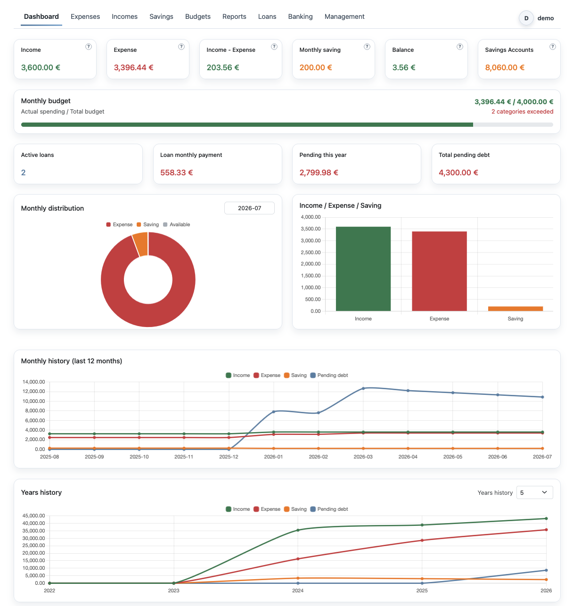
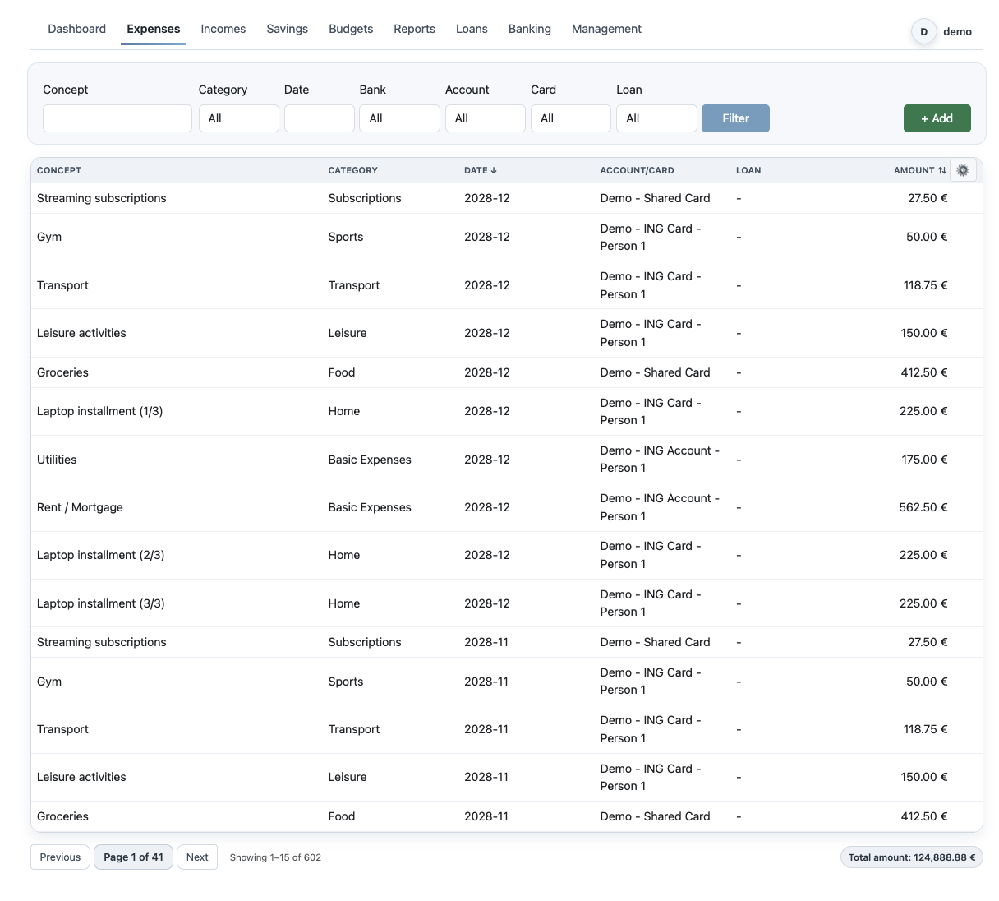
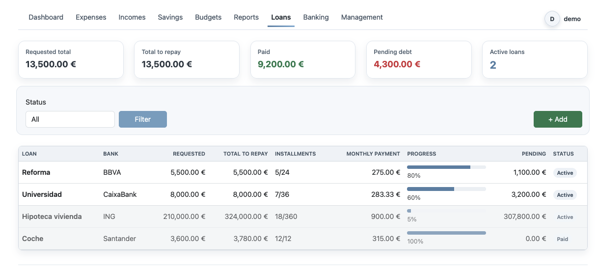
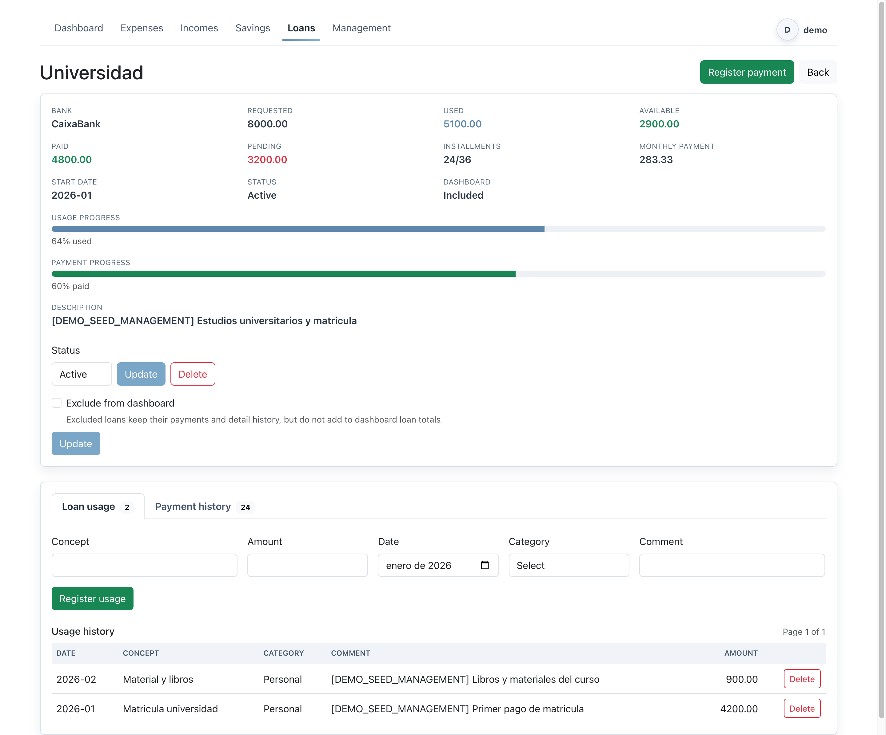
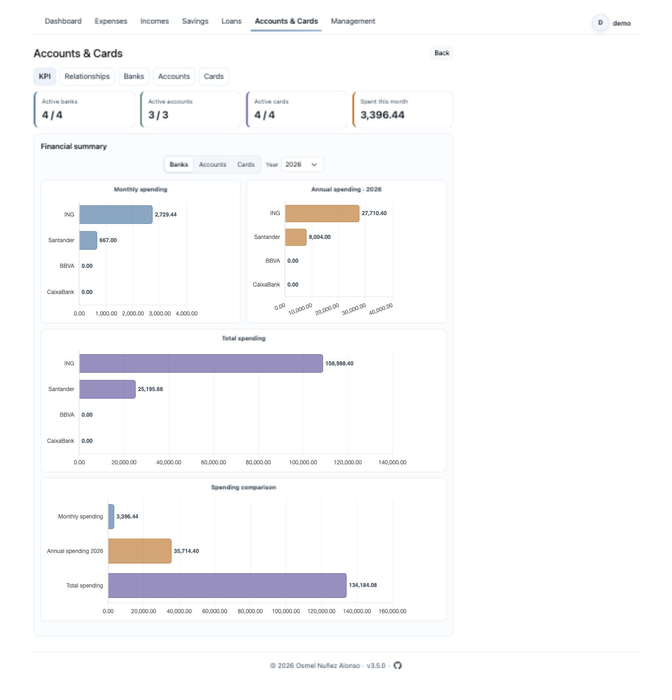
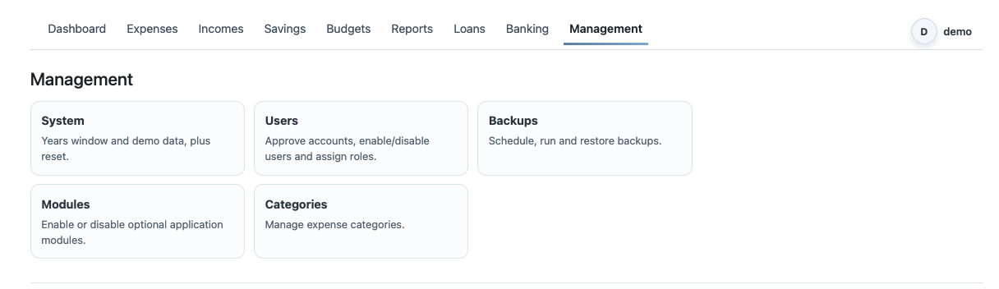
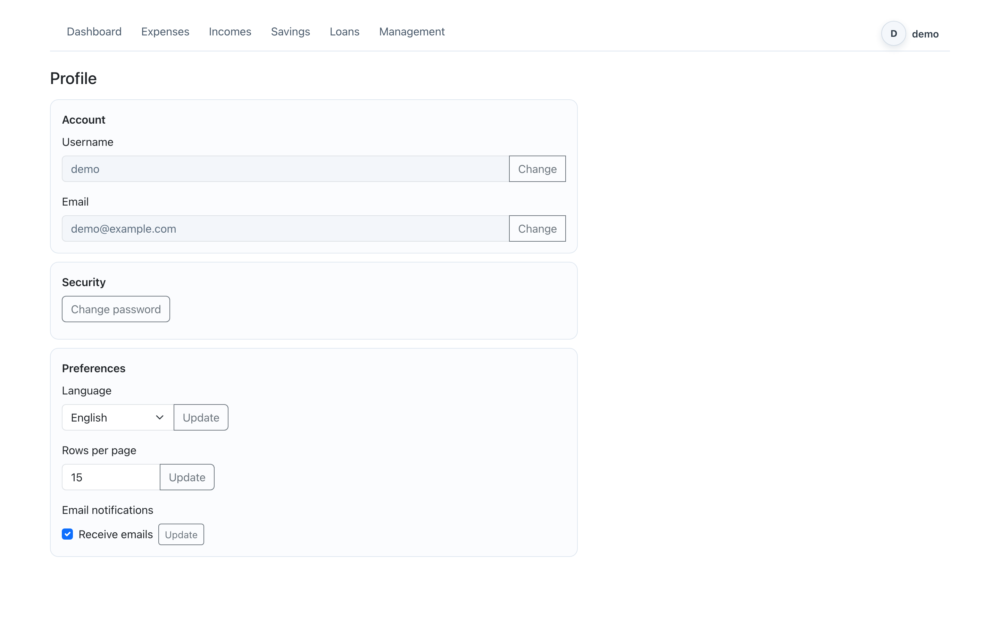

# Finance - Aplicación de Finanzas Personales


Idioma: Español | [English](./README.md)

Finance es una aplicación web Flask + PostgreSQL para gestionar finanzas personales/familiares con control por roles, dashboard, registros, copias de seguridad y reportes por correo.

Esta aplicación se creó con ayuda de IA. Las ideas y la dirección del proyecto son del autor.

Repositorio: [osmelonunez/finance](https://github.com/osmelonunez/finance)

## Versión Actual

- Versión actual: `3.7.0`
- Release: `v3.7.0 - Presupuestos e Informes`
- El compose de producción está preparado para `f1nanc3/finance:3.7.0`
- [Notas de la versión 3.7.0](docs/v3.7-release/notas-v3.7.0.md)

## Funcionalidades Principales

- Vistas separadas: `Panel`, `Gastos`, `Ingresos`, `Ahorros`, `Presupuestos`, `Informes`, `Préstamos`, `Banca`, `Gestión`
- Dashboard con gráficas mensuales y anuales, indicadores de deuda de préstamos y resumen de presupuesto
- Presupuestos vigentes por categoría, editables en el mes actual y heredados automáticamente en los meses siguientes
- Histórico mensual de solo lectura con presupuesto aplicado, gasto real, desviación y alertas al 80%, 90% y 100%
- Informes mensuales y anuales en pantalla con resumen, gasto por categoría y principales gastos
- Comparativas por mes, trimestre y año entre dos desplegables basados en la ventana de años de Finance
- Gráfico de evolución financiera para 6 meses, 12 meses o la ventana de años, con series activables
- Selector unificado de comparativas Libre, MoM y YoY con desglose por categoría y mayores aumentos/reducciones
- Filtros compartidos por categoría, banco, cuenta, tarjeta y préstamo, exportación CSV y vista de impresión/PDF
- Informes guardados por usuario con periodos, modos y filtros reutilizables
- Configuración e historial de reportes por correo integrados en Informes; SMTP permanece en Gestión
- Navegación interna de Informes separada en Resumen, Envío por correo y Plantillas de correo
- Autenticación con roles: `admin`, `editor`, `user`
- Rate limiting en endpoints de autenticación
- Preferencias por usuario:
  - idioma (`en` / `es`)
  - filas por página
  - notificaciones por correo on/off
- Módulos de Gestión:
  - usuarios
  - conexión a base de datos
  - copias de seguridad
  - SMTP + reportes por correo
  - categorías
  - ajustes del sistema
- Espacio independiente `Banca` en `/payment-methods`:
  - panel KPI con selectores de banco/cuenta/tarjeta y año
  - gráficas de gasto mensual, anual, total y comparativa
  - vista de relaciones Banco → Cuenta → Tarjeta con conexiones directas entre cada cuenta y sus tarjetas
  - pestañas separadas para gestionar bancos, cuentas y tarjetas
  - un único formulario contextual para crear bancos, cuentas o tarjetas
- Detalle de bancos, cuentas y tarjetas con totales de gasto y paginación de movimientos en servidor
- El detalle de banco muestra sus préstamos asociados y KPI de capital, deuda pendiente, importe amortizado y cuota mensual
- El gasto bancario incluye los pagos de préstamos (capital e intereses); los usos del capital son informativos y no se consideran gasto propio ni saldo disponible
- Filtros de gastos específicos por banco, cuenta y tarjeta
- Las cuentas requieren un banco y las tarjetas requieren una cuenta; no pueden eliminarse mientras tengan datos relacionados
- Los nombres de cuenta pueden repetirse entre bancos distintos; los nombres de tarjeta pueden repetirse porque las tarjetas se identifican por ID
- Formato monetario y numérico adaptado al idioma en toda la aplicación
- Préstamos con banco, cantidad, plazo, cuota mensual, descripción, estado y seguimiento de pagos
- Tipos de préstamo: sin intereses, con intereses e hipotecas con separación de amortización/intereses
- Seguimiento editable de usos de préstamo para registrar en qué se gasta el dinero prestado sin contarlo como ingreso mensual
- Pagos de préstamo registrados desde gastos sin contar la solicitud del préstamo como ingreso
- Exclusión opcional de préstamos en dashboard y totales de analíticas
- Pagos aplazados
- Categorías por defecto localizadas (`en` / `es`)
- Migraciones SQL con tabla de control
- Runtime con Gunicorn en Docker, ejecutando como usuario no root
- Logs JSON estructurados + health checks (`/health/live`, `/health/ready`)
- Optimización de consultas de dashboard + caché corto (30s) con invalidación en cambios de datos
- Diez plantillas versionadas de reportes (`v1` a `v10`) en una cuadrícula única de cinco por fila para mensual y anual
- Branding compartido para emails con nombre, cabecera y pie centrado

## Informes y analítica

El espacio `Informes` reúne el análisis financiero y la entrega por correo:

- Resúmenes mensuales y anuales de ingresos, gastos, ahorro y balance.
- Comparaciones libres, MoM y YoY por mes, trimestre o año, con variación absoluta, porcentual y desglose por categoría.
- Evolución financiera para los últimos 6 o 12 meses y para varios años, con series que se pueden activar u ocultar.
- Filtros compartidos por categoría, banco, cuenta, tarjeta y préstamo.
- Exportación contextual a CSV y una presentación específica para imprimir o guardar como PDF.
- Informes guardados por usuario que conservan periodos, modo de comparación, métricas y filtros.
- Configuración de reportes por correo, historial de entregas y diez plantillas con vista previa mensual o anual.
- Cuentas corrientes y de ahorro, con saldo inicial individual y agregado consolidado `Savings Accounts`.
- Las aportaciones de ahorro exigen una cuenta de destino; los gastos y tarjetas vinculados descuentan de esa cuenta.

## Capturas de Pantalla

### Panel


### Gastos


### Préstamos


### Detalle de préstamo


### KPI de Banca


### Gestión


### Perfil


## Stack Tecnológico

- Backend: Python, Flask, psycopg2
- Base de datos: PostgreSQL
- Frontend: plantillas Jinja2, Bootstrap, Chart.js
- Runtime: Docker, Docker Compose, Gunicorn

## Ejecución Local (Docker)

### Requisitos

- Docker + Docker Compose
- PostgreSQL accesible desde el contenedor

### Inicio

```bash
make up
```

URL de la app:
- [http://localhost:3000](http://localhost:3000)

Comandos útiles:

```bash
make restart
make logs
make down
```

## Wizard de Inicialización

En el primer acceso, la app redirige a `/setup`.

Opciones:
- `Use existing database`
- `Create new database`

Notas:
- El primer admin se crea desde el formulario del wizard.
- No existe `admin/admin` por defecto.
- La BD y el usuario de BD deben existir previamente.
- La conexión de BD se guarda en `/config/.app_config.json`.
- Si se configura `DB_CONFIG_ENCRYPTION_KEY`, se guarda cifrada.

## Despliegue en Producción (Imagen precompilada)

Fichero compose:
- `docker/docker-compose.yaml`

Comandos:

```bash
make up-prod
make logs-prod
make down-prod
```

## 🐳 Imagen Docker

- [f1nanc3/finance](https://hub.docker.com/r/f1nanc3/finance)

## Build y Publicación

Build multi-arquitectura + push (`linux/amd64,linux/arm64`):

```bash
make build
```

Build local (`f1nanc3/finance:latest`):

```bash
make build-local
```

Auditoría de dependencias:

```bash
make audit-deps
```

## Pruebas automáticas

Las pruebas se ejecutan en contenedores aislados y utilizan una base PostgreSQL temporal llamada `finance_test`. La suite rechaza cualquier `DATABASE_URL` cuyo nombre de base de datos no termine en `_test`.

```bash
make test-unit      # validadores y formato numérico
make test-routes    # rutas, métodos, autenticación, permisos y CSRF
make test-release   # suite completa con informe de cobertura
make test-endpoints # regenerar el catálogo Markdown de endpoints
make test-clean     # limpieza manual del entorno de pruebas
```

El inventario se obtiene directamente de Flask. Cada ruta nueva se incorpora al barrido y cualquier endpoint POST nuevo debe declarar explícitamente su payload de prueba.

- Catálogo versionado: [`docs/testing/endpoints.md`](docs/testing/endpoints.md).
- Informe más reciente: `test-reports/latest.md`.
- Histórico local: `test-reports/finance-test-report-YYYYMMDD-HHMMSS.md`.

## Variables Importantes para Producción

Obligatorias en producción:
- `APP_ENV=production`
- `SECRET_KEY` (valor propio, no default)
- `SMTP_ENCRYPTION_KEY` (valor propio, no default)
- `DB_CONFIG_ENCRYPTION_KEY` (obligatoria si se usa configuración de BD en `/config/.app_config.json`)

Recomendadas:
- `APP_PUBLIC_URL` (enlaces en correos)
- `SESSION_LIFETIME_HOURS` (por defecto `12`)
- `LOG_FORMAT=text` para logs coloreados en contenedor, o `json` para logs estructurados
- `LOG_COLOR=true` para colorear logs de texto por nivel (`INFO` verde, `WARNING` amarillo, `ERROR` rojo)
- `LOG_LEVEL=INFO`

Rate limits:
- `RATE_LIMIT_LOGIN_IP`
- `RATE_LIMIT_LOGIN_ID`
- `RATE_LIMIT_REGISTER_IP`
- `RATE_LIMIT_PASSWORD_CHANGE`

## Notas de Seguridad y Operación

- En producción, el arranque falla si faltan secretos obligatorios o si están en default.
- El fichero de configuración se crea con permisos `0600`.
- Las credenciales SMTP se guardan cifradas.
- La URL de BD en config puede guardarse cifrada con `DB_CONFIG_ENCRYPTION_KEY`.
- Los logs del contenedor rotan por compose:
  - `max-size: 10m`
  - `max-file: 7`
- Los logs redaccionan secretos (passwords/tokens/URLs con credenciales).

## Copias de Seguridad

- Las copias se guardan en `/backups` dentro del contenedor.
- Montajes típicos:
  - `./backups -> /backups`
  - `./config -> /config`
- Gestión (programación, retención, restauración, eliminación):
  - `Management -> Backups`

## Correo y Reportes

- SMTP se configura desde UI (`Management -> SMTP`).
- El nombre visible del remitente es configurable.
- Reportes mensual/anual activos por defecto.
- Los correos se envían solo a usuarios:
  - activos
  - con notificaciones por correo activadas
- Plantilla mensual y anual configurables entre diez estilos, incluidos Editorial, Panel, Recibo, Estado financiero, Magazine, Minimalista y Neón, con vista previa usando datos reales y branding compartido.

## Licencia

Este proyecto está bajo la [MIT License](./LICENSE).
